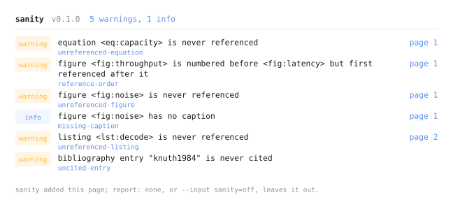

<picture>
  <source media="(prefers-color-scheme: dark)" srcset="docs/assets/banner-dark.svg" width="100%">
  
</picture>

`sanity` reads your compiled document and reports the figures nothing points at, the bibliography entries nothing cites, and the captions and labels that went missing on the way.

```typst
#import "@preview/sanity:0.1.0": *

#show: sanity
```

These two lines are *basically* what you need to use the package. When there is nothing to report, the compiled PDF is byte for byte the one you would have got without `sanity`. When there is, a page is appended listing what turned up, just like this:



> [!NOTE]
> Needs Typst 0.14 or newer. The command line script additionally needs 0.15, (`typst eval` is required).

## Manual

It is worth checking [docs/manual.pdf](docs/manual.pdf) for package details. It contains a description of each check (what it reports and where it sets the threshold) as well as the full configuration, exceptions, command-line usage, and how everything works.

This page is the short version, you can check out
[recipes](#recipes) ·
[what it checks](#what-it-checks) ·
[bibliography](#bibliography) ·
[the command line](#from-the-command-line) ·
[CI](#in-ci)

## Recipes

The import and the show rule above are the whole of what is required. Everything here is something you may never need.

**Check a document without touching it**, with the [one-file script](#from-the-command-line):

```
bin/sanity paper.typ
```

**Check the bibliography too.** A package cannot open your `.bib`, so the document hands the data over:

```typst
#show: sanity.with(bibliography: read("refs.bib"))
```

**Let one figure go unreferenced**, because it is meant to:

```typst
#sanity-ignore(<fig:cover>, reason: "decorative")
```

**Silence one check on one element**, rather than everything about it:

```typst
#sanity-ignore(<fig:map>, checks: "unreferenced-figure")
```

**Turn a check on or off**, by the id from the table below:

```typst
#show: sanity.with(checks: ("reference-order": true, "empty-caption": false))
```

**Fail the compilation instead of appending a page**, which is what CI wants:

```typst
#show: sanity.with(strict: true)
```

**Get the plain PDF back**, without editing the source:

```
typst compile --input sanity=off paper.typ
```

## What it checks

Twelve checks are performed by default as soon as you apply the `show` rule, including checks for figures, tables, listings, and equations, and many others.

Only elements you labelled yourself are reported as unreferenced, since an unlabelled figure cannot be pointed at and is often decorative. The [manual](docs/manual.pdf) gives each check an entry of its own.

## Bibliography

`uncited-entry` needs the bibliography data, and a package cannot read your `.bib`. From the command line `bin/sanity` reads it for you; inside the document, hand it over:

```typst
#show: sanity.with(bibliography: read("refs.bib"))
```

[BibTeX](https://www.bibtex.org/Format/) and [Hayagriva](https://github.com/typst/hayagriva/blob/main/docs/file-format.md) files are both understood, and an array covers a document with more than one bibliography. Without the data `sanity` says so, at `info` severity, which prints and never fails a build.

## From the command line

The [`bin/sanity`](https://github.com/techgustavo/sanity/blob/main/bin/sanity) script reports on a document without touching it, reads its bibliography for it, and exits non-zero on a warning or an error.

```
$ bin/sanity paper.typ
warning: figure <fig:latency> is never referenced [unreferenced-figure]
  ┌─ page 4

sanity: 1 warning
```

It lives here rather than in the published package, since a package cannot ship an executable:

```
curl -sSLO https://raw.githubusercontent.com/techgustavo/sanity/main/bin/sanity
chmod +x sanity
```

`--help` lists the flags.

## In CI

1 on a warning or an error, 0 otherwise, and 2 when the document itself does not compile. Any step that puts `typst` on the path will do:

```yaml
name: manuscript
on: [push, pull_request]

jobs:
  sanity:
    runs-on: ubuntu-latest
    steps:
      - uses: actions/checkout@v4
      - uses: typst-community/setup-typst@v5
      - run: |
          curl -sSLO https://raw.githubusercontent.com/techgustavo/sanity/main/bin/sanity
          chmod +x sanity
          ./sanity paper.typ
```

`strict: true` in the document makes the compilation itself fails, so `typst compile` gates the build and no script is needed.

**License:** MIT.
